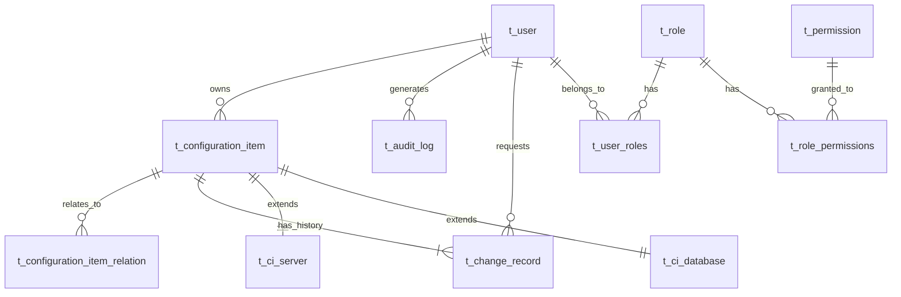

# CMDB 数据模型文档

## 1. 概述

本文档描述 CMDB 系统的数据库设计，包括表结构、字段定义、索引和关系。

## 2. 核心实体关系图

## 3. 用户与权限模块

### 3.1 用户表 (t_user)

| 字段 | 类型 | 约束 | 说明 |
|------|------|------|------|
| id | INTEGER | PRIMARY KEY | 主键 |
| username | VARCHAR(50) | UNIQUE, NOT NULL | 用户名 |
| email | VARCHAR(100) | UNIQUE, NOT NULL | 邮箱 |
| password_hash | VARCHAR(255) | NOT NULL | 密码哈希 |
| full_name | VARCHAR(100) | | 全名 |
| phone | VARCHAR(20) | | 手机号 |
| status | ENUM | DEFAULT 'active' | 状态：active/inactive/disabled |
| is_superuser | BOOLEAN | DEFAULT FALSE | 是否超级管理员 |
| created_at | TIMESTAMP | DEFAULT NOW() | 创建时间 |
| updated_at | TIMESTAMP | DEFAULT NOW() | 更新时间 |

### 3.2 角色表 (t_role)

| 字段 | 类型 | 约束 | 说明 |
|------|------|------|------|
| id | INTEGER | PRIMARY KEY | 主键 |
| name | VARCHAR(50) | UNIQUE, NOT NULL | 角色名称 |
| code | VARCHAR(50) | UNIQUE, NOT NULL | 角色代码 |
| description | TEXT | | 描述 |
| created_at | TIMESTAMP | DEFAULT NOW() | 创建时间 |
| updated_at | TIMESTAMP | DEFAULT NOW() | 更新时间 |

### 3.3 权限表 (t_permission)

| 字段 | 类型 | 约束 | 说明 |
|------|------|------|------|
| id | INTEGER | PRIMARY KEY | 主键 |
| name | VARCHAR(100) | NOT NULL | 权限名称 |
| code | VARCHAR(100) | UNIQUE, NOT NULL | 权限代码 |
| resource_type | VARCHAR(50) | NOT NULL | 资源类型 |
| actions | JSONB | | 允许的操作 |
| description | TEXT | | 描述 |

### 3.4 用户角色关联表 (t_user_roles)

| 字段 | 类型 | 约束 | 说明 |
|------|------|------|------|
| user_id | INTEGER | FK, NOT NULL | 用户 ID |
| role_id | INTEGER | FK, NOT NULL | 角色 ID |

### 3.5 角色权限关联表 (t_role_permissions)

| 字段 | 类型 | 约束 | 说明 |
|------|------|------|------|
| role_id | INTEGER | FK, NOT NULL | 角色 ID |
| permission_id | INTEGER | FK, NOT NULL | 权限 ID |

## 4. 配置项模块

### 4.1 配置项主表 (t_configuration_item)

| 字段 | 类型 | 约束 | 说明 |
|------|------|------|------|
| id | INTEGER | PRIMARY KEY | 主键 |
| ci_type | ENUM | NOT NULL | CI 类型 |
| name | VARCHAR(200) | NOT NULL | 名称 |
| code | VARCHAR(100) | UNIQUE | 编码 |
| status | ENUM | DEFAULT 'online' | 状态 |
| description | TEXT | | 描述 |
| environment | VARCHAR(50) | | 环境 |
| owner | VARCHAR(100) | | 负责人 |
| tags | JSONB | | 标签 |
| created_by | INTEGER | FK | 创建人 |
| updated_by | INTEGER | FK | 更新人 |
| created_at | TIMESTAMP | DEFAULT NOW() | 创建时间 |
| updated_at | TIMESTAMP | DEFAULT NOW() | 更新时间 |

**CI 类型枚举**: server, network_device, database, middleware, application, container, k8s_resource, cloud_resource

**状态枚举**: online, offline, maintenance, error, retired

### 4.2 配置项关系表 (t_configuration_item_relation)

| 字段 | 类型 | 约束 | 说明 |
|------|------|------|------|
| id | INTEGER | PRIMARY KEY | 主键 |
| source_ci_id | INTEGER | FK, NOT NULL | 源 CI ID |
| target_ci_id | INTEGER | FK, NOT NULL | 目标 CI ID |
| relation_type | VARCHAR(50) | NOT NULL | 关系类型 |
| description | TEXT | | 描述 |
| created_at | TIMESTAMP | DEFAULT NOW() | 创建时间 |

**关系类型**: depends_on, connects_to, runs_on, contains, deployed_on

### 4.3 服务器表 (t_ci_server)

| 字段 | 类型 | 约束 | 说明 |
|------|------|------|------|
| id | INTEGER | PRIMARY KEY | 主键 |
| ci_id | INTEGER | FK, UNIQUE | CI ID |
| hostname | VARCHAR(100) | NOT NULL | 主机名 |
| ip_address | VARCHAR(50) | NOT NULL | IP 地址 |
| os_type | VARCHAR(50) | | 操作系统类型 |
| os_version | VARCHAR(50) | | 操作系统版本 |
| cpu_cores | INTEGER | | CPU 核心数 |
| memory_gb | INTEGER | | 内存 (GB) |
| disk_gb | INTEGER | | 磁盘 (GB) |

### 4.4 网络设备表 (t_ci_network_device)

| 字段 | 类型 | 约束 | 说明 |
|------|------|------|------|
| id | INTEGER | PRIMARY KEY | 主键 |
| ci_id | INTEGER | FK, UNIQUE | CI ID |
| device_type | VARCHAR(50) | NOT NULL | 设备类型 |
| vendor | VARCHAR(100) | | 厂商 |
| model | VARCHAR(100) | | 型号 |
| ip_address | VARCHAR(50) | NOT NULL | IP 地址 |
| mac_address | VARCHAR(50) | | MAC 地址 |
| port_count | INTEGER | | 端口数 |

### 4.5 数据库表 (t_ci_database)

| 字段 | 类型 | 约束 | 说明 |
|------|------|------|------|
| id | INTEGER | PRIMARY KEY | 主键 |
| ci_id | INTEGER | FK, UNIQUE | CI ID |
| db_type | VARCHAR(50) | NOT NULL | 数据库类型 |
| version | VARCHAR(50) | | 版本 |
| host | VARCHAR(200) | NOT NULL | 主机 |
| port | INTEGER | | 端口 |
| instance_name | VARCHAR(100) | | 实例名 |
| max_connections | INTEGER | | 最大连接数 |

### 4.6 中间件表 (t_ci_middleware)

| 字段 | 类型 | 约束 | 说明 |
|------|------|------|------|
| id | INTEGER | PRIMARY KEY | 主键 |
| ci_id | INTEGER | FK, UNIQUE | CI ID |
| middleware_type | VARCHAR(50) | NOT NULL | 中间件类型 |
| version | VARCHAR(50) | | 版本 |
| host | VARCHAR(200) | NOT NULL | 主机 |
| port | INTEGER | | 端口 |
| cluster_nodes | JSONB | | 集群节点 |

### 4.7 应用表 (t_ci_application)

| 字段 | 类型 | 约束 | 说明 |
|------|------|------|------|
| id | INTEGER | PRIMARY KEY | 主键 |
| ci_id | INTEGER | FK, UNIQUE | CI ID |
| app_type | VARCHAR(50) | NOT NULL | 应用类型 |
| version | VARCHAR(50) | | 版本 |
| deploy_url | VARCHAR(500) | | 部署 URL |
| health_check_url | VARCHAR(500) | | 健康检查 URL |
| dependencies | JSONB | | 依赖 |

### 4.8 容器表 (t_ci_container)

| 字段 | 类型 | 约束 | 说明 |
|------|------|------|------|
| id | INTEGER | PRIMARY KEY | 主键 |
| ci_id | INTEGER | FK, UNIQUE | CI ID |
| container_id | VARCHAR(100) | NOT NULL | 容器 ID |
| image | VARCHAR(200) | NOT NULL | 镜像 |
| host | VARCHAR(200) | NOT NULL | 宿主机 |
| status | VARCHAR(50) | | 状态 |
| ports | JSONB | | 端口映射 |
| created_at_time | TIMESTAMP | | 创建时间 |

### 4.9 K8s 资源表 (t_ci_k8s_resource)

| 字段 | 类型 | 约束 | 说明 |
|------|------|------|------|
| id | INTEGER | PRIMARY KEY | 主键 |
| ci_id | INTEGER | FK, UNIQUE | CI ID |
| resource_type | VARCHAR(50) | NOT NULL | 资源类型 |
| namespace | VARCHAR(100) | NOT NULL | 命名空间 |
| cluster_name | VARCHAR(100) | | 集群名称 |
| yaml_config | TEXT | | YAML 配置 |
| replicas | INTEGER | | 副本数 |

### 4.10 云资源表 (t_ci_cloud_resource)

| 字段 | 类型 | 约束 | 说明 |
|------|------|------|------|
| id | INTEGER | PRIMARY KEY | 主键 |
| ci_id | INTEGER | FK, UNIQUE | CI ID |
| cloud_provider | VARCHAR(50) | NOT NULL | 云厂商 |
| region | VARCHAR(50) | | 区域 |
| instance_type | VARCHAR(100) | | 实例类型 |
| instance_id | VARCHAR(100) | | 实例 ID |
| public_ip | VARCHAR(50) | | 公网 IP |
| private_ip | VARCHAR(50) | | 私网 IP |

## 5. 变更管理模块

### 5.1 变更记录表 (t_change_record)

| 字段 | 类型 | 约束 | 说明 |
|------|------|------|------|
| id | INTEGER | PRIMARY KEY | 主键 |
| ci_id | INTEGER | FK, NOT NULL | CI ID |
| change_type | ENUM | NOT NULL | 变更类型 |
| change_status | ENUM | DEFAULT 'pending' | 变更状态 |
| priority | ENUM | DEFAULT 'medium' | 优先级 |
| description | TEXT | NOT NULL | 描述 |
| reason | TEXT | | 原因 |
| planned_start_time | TIMESTAMP | | 计划开始时间 |
| planned_end_time | TIMESTAMP | | 计划结束时间 |
| actual_start_time | TIMESTAMP | | 实际开始时间 |
| actual_end_time | TIMESTAMP | | 实际结束时间 |
| requested_by | INTEGER | FK, NOT NULL | 申请人 |
| approved_by | INTEGER | FK | 审批人 |
| created_at | TIMESTAMP | DEFAULT NOW() | 创建时间 |
| updated_at | TIMESTAMP | DEFAULT NOW() | 更新时间 |

**变更类型**: create, update, delete, rollback

**变更状态**: pending, reviewing, approved, rejected, completed, cancelled

**优先级**: low, medium, high, critical

## 6. 审计日志模块

### 6.1 审计日志表 (t_audit_log)

| 字段 | 类型 | 约束 | 说明 |
|------|------|------|------|
| id | INTEGER | PRIMARY KEY | 主键 |
| user_id | INTEGER | FK | 用户 ID |
| username | VARCHAR(50) | NOT NULL | 用户名 |
| action | ENUM | NOT NULL | 动作 |
| status | ENUM | NOT NULL | 状态 |
| resource_type | VARCHAR(50) | | 资源类型 |
| resource_id | INTEGER | | 资源 ID |
| request_method | VARCHAR(10) | | 请求方法 |
| request_path | VARCHAR(500) | | 请求路径 |
| ip_address | VARCHAR(50) | | IP 地址 |
| user_agent | TEXT | | User-Agent |
| details | JSONB | | 详情 |
| created_at | TIMESTAMP | DEFAULT NOW() | 创建时间 |

**审计动作**: login, logout, create_resource, update_resource, delete_resource, view_resource, export_resource, import_resource, approve_change, reject_change

**审计状态**: success, failed

## 7. 索引设计

### 7.1 用户模块索引
- `idx_user_username` ON t_user(username)
- `idx_user_email` ON t_user(email)
- `idx_user_status` ON t_user(status)

### 7.2 配置项模块索引
- `idx_ci_type` ON t_configuration_item(ci_type)
- `idx_ci_status` ON t_configuration_item(status)
- `idx_ci_name` ON t_configuration_item(name)
- `idx_ci_owner` ON t_configuration_item(owner)
- `idx_ci_created_at` ON t_configuration_item(created_at)
- `idx_ci_relation_source` ON t_configuration_item_relation(source_ci_id)
- `idx_ci_relation_target` ON t_configuration_item_relation(target_ci_id)

### 7.3 变更管理索引
- `idx_change_ci_id` ON t_change_record(ci_id)
- `idx_change_status` ON t_change_record(change_status)
- `idx_change_created_at` ON t_change_record(created_at)

### 7.4 审计日志索引
- `idx_audit_user_id` ON t_audit_log(user_id)
- `idx_audit_action` ON t_audit_log(action)
- `idx_audit_created_at` ON t_audit_log(created_at)

## 8. 数据字典

### 8.1 枚举类型值

**UserStatus**
- active: 活跃
- inactive: 未激活
- disabled: 已禁用

**CIType**
- server: 服务器
- network_device: 网络设备
- database: 数据库
- middleware: 中间件
- application: 应用
- container: 容器
- k8s_resource: K8s 资源
- cloud_resource: 云资源

**CIStatus**
- online: 在线
- offline: 离线
- maintenance: 维护中
- error: 故障
- retired: 已退役

**ChangeType**
- create: 创建
- update: 更新
- delete: 删除
- rollback: 回滚

**ChangeStatus**
- pending: 待处理
- reviewing: 审批中
- approved: 已批准
- rejected: 已拒绝
- completed: 已完成
- cancelled: 已取消

**ChangePriority**
- low: 低
- medium: 中
- high: 高
- critical: 紧急

**AuditAction**
- login: 登录
- logout: 登出
- create_resource: 创建资源
- update_resource: 更新资源
- delete_resource: 删除资源
- view_resource: 查看资源
- export_resource: 导出资源
- import_resource: 导入资源
- approve_change: 批准变更
- reject_change: 拒绝变更

**AuditStatus**
- success: 成功
- failed: 失败
